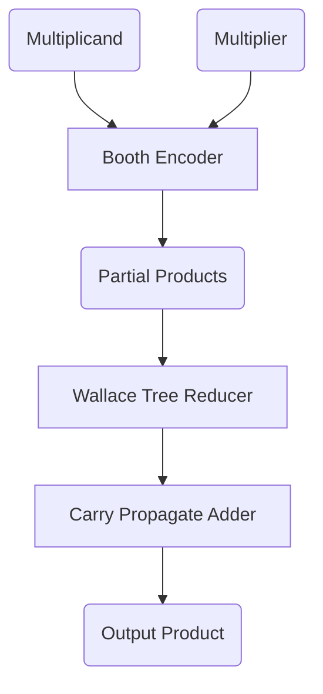

# 🟩 Booth Encoded Wallace Tree Multiplier

## 🚀 Overview

The **Booth Encoded Wallace Tree Multiplier** is a high-speed, area-efficient digital multiplier architecture, combining two powerful techniques:
- **Booth Encoding**: Reduces the number of partial products by encoding the multiplier, dramatically improving multiplication speed and efficiency.
- **Wallace Tree**: Organizes and sums the partial products in a tree-like fashion, enabling fast parallel addition.

This project provides a hardware description (typically in Verilog or VHDL) for a Booth Encoded Wallace Tree Multiplier, suitable for FPGA or ASIC implementations.

---

## 🧠 Key Concepts

### 1️⃣ Booth Encoding

Booth Encoding is an algorithm that transforms the binary multiplier to reduce the number of required addition/subtraction operations. It efficiently handles both positive and negative numbers, which makes it ideal for signed multiplication.

#### ⭐ Booth Encoding Advantages
- Reduces the number of partial products (≈ half compared to conventional).
- Efficient for signed and negative numbers.
- Minimizes hardware complexity for large multipliers.

### 2️⃣ Wallace Tree

A Wallace Tree is a hardware architecture to sum up the generated partial products quickly and in parallel using layers of adders (full and half adders).

#### ⭐ Wallace Tree Advantages
- Parallel reduction of partial products.
- Significantly faster than ripple-carry or array multipliers.
- Ideal for high-speed arithmetic circuits.

---

## 🔄 How It Works



1. **Inputs**: Multiplicand and Multiplier (both signed/unsigned).
2. **Booth Encoder**: Generates encoded partial products from the multiplier.
3. **Wallace Tree**: Parallel reduction of partial products using layers of adders.
4. **Final Adder**: The last two rows are summed using a fast adder (e.g., carry-lookahead adder).
5. **Output**: High-speed, accurate product.

---

## 🎨 Visual Example


*Above: Booth encoding creates fewer partial products, Wallace Tree sums them in parallel layers.*

---

## 📂 File Structure

```
Booth-Encoded-Wallace-Tree-Multiplier/
├── src/                # Source HDL (Verilog/VHDL) files
├── tb/                 # Testbenches
├── docs/               # Documentation and diagrams
├── README.md           # This file
└── ...
```

---

## 🛠️ Usage

1. **Integrate** the multiplier module into your hardware design.
2. **Simulate** using provided testbenches.
3. **Synthesize** for FPGA/ASIC targets.

### Example (Verilog Module Instantiation)
```verilog
booth_wallace_multiplier #(.WIDTH(8)) uut (
    .multiplicand(a),
    .multiplier(b),
    .product(prod)
);
```

---

## 📈 Performance & Applications

- **Speed**: Much faster than traditional multipliers for large bit-widths.
- **Area**: Optimized due to fewer partial products and parallel reduction.
- **Applications**: Digital Signal Processing (DSP), Graphics, Cryptography, Embedded Systems.

---

## 👩‍💻 Contributors

- [@im-sks](https://github.com/im-sks) (Author & Maintainer)
- [@sikandar-irfan](https://github.com/sikandar-irfan) (Author & Maintainer)

---

## 📚 References

- [Booth's Algorithm - Wikipedia](https://en.wikipedia.org/wiki/Booth%27s_multiplier)
- [Wallace Tree - Wikipedia](https://en.wikipedia.org/wiki/Wallace_tree)
- [Fast Multiplication Algorithms](https://www.eetimes.com/the-wallace-tree-multiplier/)

---

## 🌟 License

MIT License. See [LICENSE](LICENSE) for details.

---

> **Bringing speed and efficiency to digital multiplication!**
